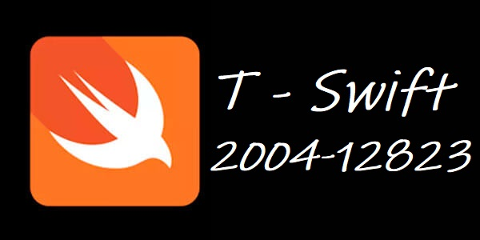

## T-Swift 200412823
### Compilers

developed by **Ben Cotto** 
email: esdrasbenjamin@gmail.com 

#### Description
 T-Swift IDE is a development environment that provides the tools for writing programs in the T-Swift language. 
 This IDE gives us the possibility of viewing both the console output of the source file execution and the various 
 application reports that are explained later. The graphic interface may be developed with the architecture and framework of the student's choice, 
 as long as the language and tools indicated by the tutors are used for the processing and recognition of the T-Swift language.

----

